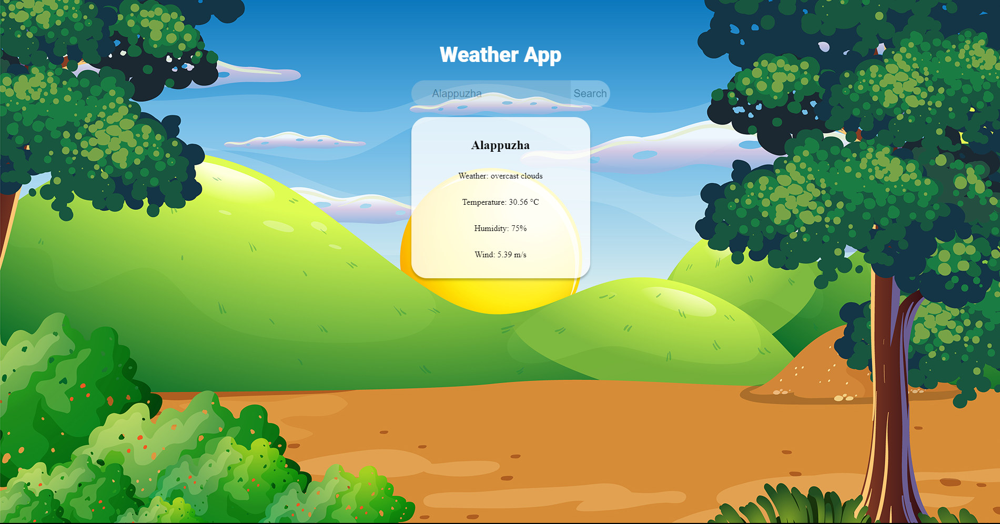
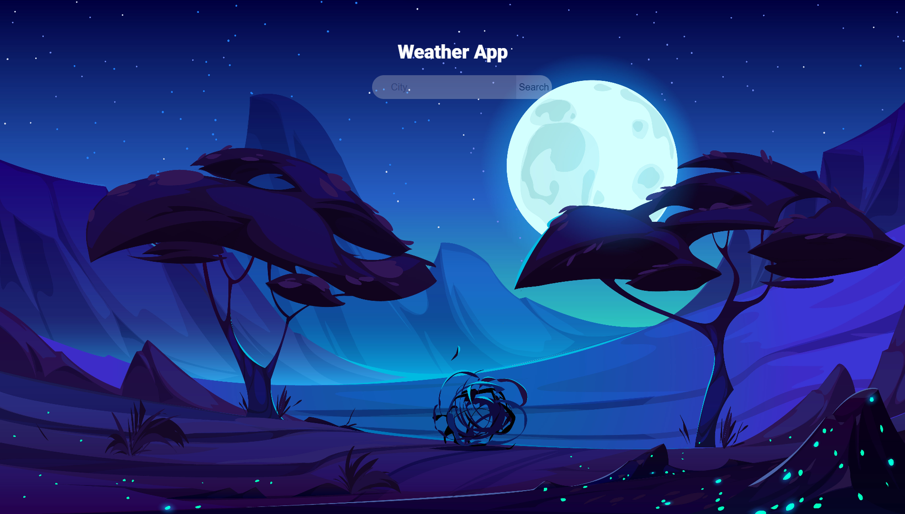

<h1>Weather App</h1>
From 6 AM to 6 PM This is the Background Image for the site

From 6 PM to 6 AM This is the Background Image for the site  

This is a simple weather app built with React.js that allows users to search for weather information by city name. The app uses the OpenWeatherMap API to fetch real-time weather data and displays it to the user.

Features
Search for weather information by city name
Display current weather conditions including temperature, weather description, humidity, and wind speed
Background image changes based on the time of day (day/night)

Technologies Used
React.js
Styled Components
Axios
Acknowledgements
OpenWeatherMap for providing the weather data API.
Background images taken from Freepik.com

<h1>License</h1>
This project is licensed under the MIT License - see the LICENSE file for details.
